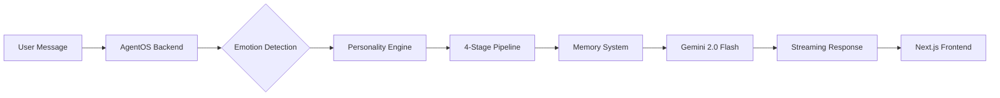

<div align="center">

# 🎭 Personality-Driven AI Assistant

*An intelligent AI companion that adapts its communication style to match your emotional state*

[](https://nextjs.org/)
[](https://python.org/)
[](https://agno.com/)
[](LICENSE)

[Live Demo](https://ai-engineer-internship-task.vercel.app) · [Report Bug](https://github.com/Krrish777/AI-Engineer-Internship-Task/issues) · [Request Feature](https://github.com/Krrish777/AI-Engineer-Internship-Task/issues)

</div>

---

## ✨ What Makes This Special?

Unlike traditional chatbots that respond in a monotone way, this AI assistant **reads the room**. Feeling frustrated? It becomes empathetic. Celebrating a win? It matches your energy with wit and enthusiasm. Need guidance? It transforms into a patient mentor.

### 🎯 Key Features

- 🎭 **Three Distinct Personalities**
  - **Calm Mentor**: Patient, wise, and grounded—perfect for learning and problem-solving
  - **Witty Friend**: Playful, clever, and energetic—brings humor to conversations
  - **Therapist**: Warm, validating, and reflective—offers emotional support

- 🧠 **Persistent Memory**
  - Remembers your name, preferences, and conversation history
  - Tracks emotional patterns across sessions
  - Each user gets isolated memory space (privacy-first)

- 🔄 **Intelligent Auto-Switching**
  - Detects emotional cues in real-time
  - Seamlessly transitions between personalities
  - No manual switching needed (but you can if you want!)

- 💬 **Beautiful Chat Experience**
  - Real-time streaming responses
  - Markdown support with syntax highlighting
  - Clean, modern UI built with Next.js and Tailwind CSS
  - Responsive design for all devices

## 🎬 Demo

https://github.com/user-attachments/assets/your-demo-video.mp4

> **Try it live:** [ai-engineer-internship-task.vercel.app](https://ai-engineer-internship-task.vercel.app)

## 🏗️ Architecture

<details>
<summary><b>Project Structure</b> (click to expand)</summary>

```
AI-Engineer-Internship-Task/
├── 🐍 backend/                    # Python backend powered by AgentOS
│   ├── src/
│   │   ├── personality/           # 🎭 Personality engine & profiles
│   │   │   ├── engine.py         # Main personality switching logic
│   │   │   ├── models.py         # Personality data models
│   │   │   └── profiles/         # JSON configs for each personality
│   │   ├── memory/               # 🧠 Memory extraction system
│   │   │   └── extractors/       # Preference, fact, emotion extractors
│   │   ├── pipeline/             # ⚙️ 4-stage response transformation
│   │   │   ├── transformer.py    # Pipeline orchestrator
│   │   │   └── stages.py         # Individual transformation stages
│   │   └── core/                 # 🔧 Config & logging
│   ├── main.py                   # 🚀 AgentOS entry point
│   ├── Dockerfile                # 🐳 Container configuration
│   └── pyproject.toml            # 📦 Python dependencies
│
├── ⚛️ frontend/                   # Next.js 15 frontend
│   └── src/
│       ├── app/                  # 📄 Pages & layouts
│       ├── components/           # 🎨 Reusable UI components
│       │   ├── chat/            # Chat interface components
│       │   └── ui/              # Base UI primitives
│       ├── hooks/               # 🪝 Custom React hooks
│       ├── api/                 # 🌐 API client & routes
│       └── store.ts             # 💾 Global state management
│
├── .github/                      # ⚙️ CI/CD & workflows
└── logs/                         # 📊 Application logs
```

</details>

### How It Works



1. **Message Received**: User sends a message through the Next.js interface
2. **Emotion Analysis**: Backend analyzes emotional cues (frustration, joy, neutral)
3. **Personality Selection**: Engine picks the appropriate personality
4. **Response Pipeline**: 4-stage transformation (context → personality → refinement → polish)
5. **Memory Updates**: Extracts and stores preferences, facts, emotional patterns
6. **LLM Generation**: Gemini 2.0 Flash generates contextual response
7. **Stream to Client**: Real-time streaming via Server-Sent Events

## 🚀 Quick Start

### Prerequisites

Make sure you have these installed:

- 🐍 **Python 3.13+** - [Download](https://python.org/)
- 📦 **Node.js 18+** - [Download](https://nodejs.org/)
- ⚡ **uv** (Python package manager) - [Install](https://github.com/astral-sh/uv)
- 🔑 **Google Gemini API Key** - [Get one free](https://makersuite.google.com/app/apikey)

### 🎯 Run Locally (5 minutes)

#### 1️⃣ Clone the Repository

```bash
git clone https://github.com/Krrish777/AI-Engineer-Internship-Task.git
cd AI-Engineer-Internship-Task
```

#### 2️⃣ Start the Backend

```bash
cd backend

# Copy the example env file and add your API key
cp .env.example .env

# Edit .env and replace 'your_google_api_key_here' with your actual Gemini API key

# Install dependencies
uv sync

# Run the server
uv run python main.py
```

✅ Backend running at `http://localhost:8000`  
📚 API docs at `http://localhost:8000/docs`

#### 3️⃣ Start the Frontend

```bash
# Open a new terminal
cd frontend

# Install dependencies
npm install

# Start dev server
npm run dev
```

✅ Frontend running at `http://localhost:3000`

#### 4️⃣ Open & Chat!

Navigate to `http://localhost:3000` and start chatting! The AI will automatically detect your emotional state and adapt its personality.

### 🐳 Docker (Alternative)

```bash
# Build and run backend
cd backend
docker build -t personality-ai-backend .
docker run -p 8000:8000 --env-file .env personality-ai-backend

# Frontend runs on Vercel (production) or npm run dev (local)
```

## 🎭 Meet the Personalities

<table>
<tr>
<td width="33%" valign="top">

### 🧘 Calm Mentor

*"Let's break this down together."*

**Traits:**
- Patient & supportive
- Uses teaching analogies
- Structured guidance
- Encouraging tone

**Best for:**
- Learning new concepts
- Problem-solving
- Technical questions
- Professional advice

</td>
<td width="33%" valign="top">

### 😄 Witty Friend

*"Oh, this is gonna be fun!"*

**Traits:**
- Playful & humorous
- Casual language
- Pop culture references
- High energy

**Best for:**
- Casual conversations
- Brainstorming
- Celebrations
- Light-hearted chats

</td>
<td width="33%" valign="top">

### 💙 Therapist

*"I hear you, that sounds difficult."*

**Traits:**
- Warm & empathetic
- Active listening
- Validating feelings
- Gentle guidance

**Best for:**
- Emotional support
- Venting frustrations
- Personal struggles
- Feeling overwhelmed

</td>
</tr>
</table>

### 🔄 Auto-Switching Logic

The AI analyzes your messages in real-time:

```
User: "I'm so stressed about this deadline..."
→ Switches to Therapist 💙

User: "I just got promoted!"
→ Switches to Witty Friend 😄

User: "How do I implement binary search?"
→ Switches to Calm Mentor 🧘
```

**Detection Keywords:**
- **Therapist Triggers**: "stressed", "frustrated", "I feel", "struggling", "can't cope"
- **Witty Friend Triggers**: "excited", "celebrate", "joke", "bored", "make me laugh"
- **Calm Mentor**: Default for neutral queries and learning

## 🛠️ Tech Stack

<table>
<tr>
<td valign="top" width="50%">

### Backend

- **[AgentOS](https://agno.com)** - AI agent orchestration framework
- **[Gemini 2.0 Flash](https://ai.google.dev)** - Google's latest LLM
- **FastAPI** - High-performance async web framework
- **SQLite** - Local database for sessions & memory
- **Python 3.13** - Latest Python features
- **uv** - Ultra-fast Python package manager

</td>
<td valign="top" width="50%">

### Frontend

- **Next.js 15** - React framework with App Router
- **TypeScript** - Type-safe development
- **Tailwind CSS** - Utility-first styling
- **Zustand** - Lightweight state management
- **Radix UI** - Accessible component primitives
- **Server-Sent Events** - Real-time streaming

</td>
</tr>
</table>

### 🚢 Deployment

- **Frontend**: [Vercel](https://vercel.com) - Zero-config Next.js hosting
- **Backend**: [Render](https://render.com) - Containerized Python deployment
- **CI/CD**: GitHub Actions - Automated deployments on push

## 🎯 Roadmap

- [ ] Voice input/output support
- [ ] Custom personality creation
- [ ] Multi-language support
- [ ] Mobile app (React Native)
- [ ] Conversation analytics dashboard
- [ ] Export chat history
- [ ] Integration with productivity tools (Notion, Slack)

## 🤝 Contributing

Contributions are welcome! Feel free to:

1. 🍴 Fork the repository
2. 🌿 Create a feature branch (`git checkout -b feature/AmazingFeature`)
3. 💾 Commit your changes (`git commit -m 'Add some AmazingFeature'`)
4. 📤 Push to the branch (`git push origin feature/AmazingFeature`)
5. 🔁 Open a Pull Request

## 📝 License

This project is licensed under the MIT License - see the [LICENSE](LICENSE) file for details.

## 👨‍💻 Author

<div align="center">

**Krish Sharma**

*Building intelligent systems that understand humans better*

[](https://github.com/Krrish777)
[](https://www.linkedin.com/in/krish-sharma-3375b927b/)

</div>

---

<div align="center">

**⭐ Star this repo if you found it helpful!**

Made with ❤️ and ☕ by [Krish Sharma](https://github.com/Krrish777)

</div>
